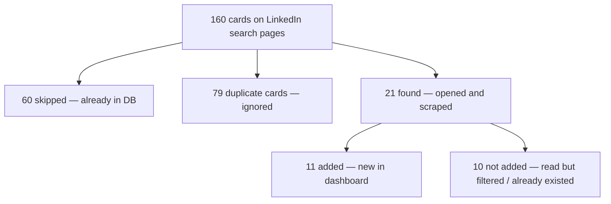

# Статистика последнего запуска (Last run)

Пример строки в dashboard:

```
Last run: 21 found · 11 added · 10 skipped · 160 total
```

## Важно: счётчики не складываются в total

Метрики относятся к **разным этапам** пайплайна. Их нельзя вычитать из `total` как одну таблицу.

**`added` — не отдельная категория рядом с `found`.**  
`added` — это подмножество `found`:

| Метрика | Значение | Смысл |
|---------|----------|-------|
| **found** | 21 | Сколько вакансий реально открыли и прочитали |
| **added** | 11 | Сколько из этих 21 попало в базу после Ollama |
| *(из found)* | 10 | Прочитали, но в базу не добавили (уже были, дубликат ссылки, отфильтровались) |

Формула `160 − 21 − 11 − 10` **некорректна**: 11 уже входят в 21.

## Что такое 160 total

**160** — это `total seen`: сколько **карточек вакансий бот увидел** на страницах поиска LinkedIn за этот прогон (листал выдачу, считал карточки). Это не «все вакансии на LinkedIn навсегда», а то, что попало в скролл за один запуск.

Пример из `reports/run.log`:

```
160 vacancy card(s) seen on search (21 read, 60 already in list, 79 duplicate)
```

Разбивка:

| Что | Сколько | Что с ними |
|-----|---------|------------|
| **read / found** | 21 | Открыли, сохранили в raw-отчёт, прогнали через Ollama |
| **already in list / skipped** | 60 | Уже в базе → **не открывали**, только пролистали |
| **duplicate** | 79 | Та же вакансия повторно на страницах поиска → **игнор** |
| **Итого seen** | 160 | 21 + 60 + 79 |

## Почему «остальные» карточки не обрабатываются

### Главное

**~79 — это не 79 новых вакансий, которые мы «забыли».**  
Это **повторные карточки** одних и тех же вакансий на выдаче LinkedIn. Их не нужно ни сканировать, ни класть в базу — информация уже учтена в других счётчиках.

Для прогона из `run.log` баланс сходится точно:

```
160 seen = 21 read + 60 already in list + 79 duplicate
```

### Схема потока



### Три причины «не трогаем» — по коду

Логика в `scripts/read-jobs.js`.

#### 1. Duplicate (~79) — та же вакансия второй раз на экране

Для каждой карточки берётся `jobKey` (ID из `/jobs/view/12345`). Если ID уже встречался в этом прогоне — карточка **пропускается**:

```javascript
if (jobKey && seenJobKeys.has(jobKey)) {
  skippedDuplicate += 1;
  continue;
}
```

**Зачем:** LinkedIn часто показывает одну вакансию несколько раз (разные страницы, promoted, повтор в списке). Повторный клик = лишние секунды, риск блокировки, дубликаты в отчёте — **без новой информации**.

#### 2. Skipped (~60) — уже есть в вашей базе

```javascript
if (jobKey && existingJobKeys.has(jobKey)) {
  skippedExisting += 1;
  continue;
}
```

**Зачем:** вакансия уже в `dashboard-jobs.json`. Сканировать снова = трата времени и Ollama. Это **осознанная оптимизация** (`LINKEDIN_SKIP_EXISTING` включён по умолчанию).

#### 3. Лимит `maxJobsPerSearch` (по умолчанию 200)

После достижения лимита новые карточки **видны** (`totalSeen++`), но **не открываются**:

```javascript
if (jobs.length >= maxJobsPerSearch) {
  continue;
}
```

В примере выше лимит не сработал (прочитали только 21) — бот дошёл до конца выдачи или остановился по условиям пагинации.

### Почему «ни куда не добавляем» в UI

| Счётчик | Где есть | Где нет |
|---------|----------|---------|
| `found`, `added`, `total` | dashboard `lastRunStats` | — |
| `skipped` (already in DB) | частично в UI (оценка `found − added` для старых прогонов) | точное значение из scrape |
| `skippedDuplicate` (~79) | только `reports/run.log` | raw-отчёт, JSON сценария, dashboard |

**~79 не «теряются» — они просто не отображаются** в строке Last run. В логе они есть:

```
LinkedIn: skipped 79 duplicate card(s) on search pages.
```

`read-jobs.js` возвращает только `skippedExisting`, не `skippedDuplicate`. `buildRawReport` пишет `Skipped existing`, но не `Skipped duplicate`.

### Ответ одной фразой

**Мы их не обрабатываем, потому что это не новые вакансии:** 60 уже в базе, 79 — повтор того же ID на выдаче. Обрабатывать = дублировать работу. Новые уникальные за этот прогон — те **21 found**, из них **11 added**.

## Если понадобится «добрать» больше

- **Уникальные новые, которые не попали в 21:** обычно их просто не было среди 160 карточек (фильтр LinkedIn, geo, период 1 день). Нужен другой поиск или больший `maxJobsPerSearch`.
- **Показать duplicates в UI:** отдельная доработка — вернуть `skippedDuplicate` из scrape, сохранить в `lastRunStats`, добавить в строку Last run (например `… · 79 duplicates · …`).

## Краткий итог

- **160 total** — всё, что бот **увидел** на выдаче
- **skipped** — увидел, но **не стал открывать** (уже в базе)
- **found** — **открыл и прочитал**
- **added** — из прочитанных **сохранил в базу**
- **остальное** — дубликаты карточек на выдаче (тот же job ID), не новые вакансии
